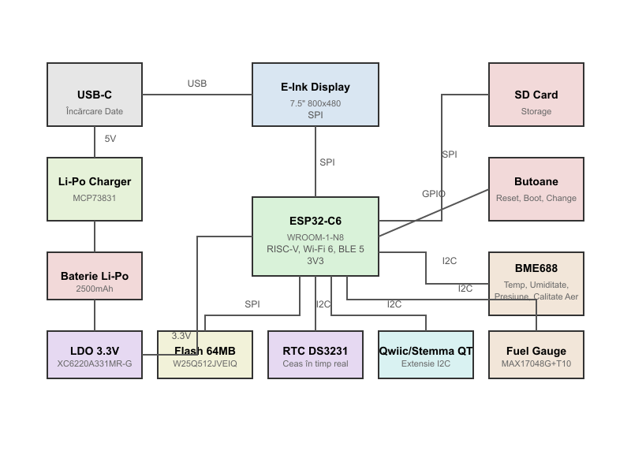

# OpenBook E-Reader

## Despre proiect
OpenBook e un e-reader open-source facut sa fie simplu, eco-friendly si sa ofere o experienta de citit fara distractii. Am vrut sa fac un e-reader la care oricine poate contribui si pe care il poate personaliza, care sa aiba si senzori de mediu integrati.

## Diagrama bloc

## Hardware folosit

Proiectul e construit in jurul unui ESP32-C6 si are un ecran e-paper de 7.5 inch, senzori de mediu si un sistem de management al bateriei. Am incercat sa fac totul modular si cat mai open-source.

### Lista de componente

| Componenta | Part Number | Descriere | Interfata | Datasheet | Link furnizor |
|-----------|-------------|-----------|-----------|-----------|---------------|
| Microcontroller | ESP32-C6-WROOM-1-N8 | Wi-Fi 6, BLE5, RISC-V | - | [Datasheet](https://www.espressif.com/sites/default/files/documentation/esp32-c6-wroom-1_datasheet_en.pdf) | [Mouser](https://www.mouser.com/ProductDetail/Espressif-Systems/ESP32-C6-WROOM-1-N8) |
| Ecran | WSH-13187 | Ecran e-Paper de 7.5" (800x480) | SPI | [Datasheet](https://www.waveshare.com/w/upload/7/7f/7.5inch-e-paper-specification.pdf) | [Waveshare](https://www.waveshare.com/7.5inch-e-paper.htm) |
| Senzor mediu | BME688 | Temperatura, umiditate, presiune, calitate aer | I2C | [Datasheet](https://www.bosch-sensortec.com/media/boschsensortec/downloads/datasheets/bst-bme688-ds000.pdf) | [Mouser](https://www.mouser.com/ProductDetail/Bosch-Sensortec/BME688) |
| Baterie | - | 2500mAh Li-Po cu protectie | - | - | [Mouser](https://www.mouser.com/ProductDetail/DFR0559) |
| Incarcare baterie | MCP73831 | Incarcator pentru Li-Po | - | [Datasheet](https://ww1.microchip.com/downloads/en/DeviceDoc/MCP73831-Family-Data-Sheet-DS20001984H.pdf) | [Mouser](https://www.mouser.com/ProductDetail/579-MCP73831T-2ACI-OT) |
| Masurare baterie | MAX17048G+T10 | Fuel gauge pentru baterie | I2C | [Datasheet](https://www.analog.com/media/en/technical-documentation/data-sheets/MAX17048-MAX17049.pdf) | [Mouser](https://www.mouser.com/ProductDetail/700-MAX17048G%2bT10) |
| Regulator LDO | XC6220A331MR-G | Stabilizator 3.3V | - | [Datasheet](https://www.torexsemi.com/file/xc6220/XC6220.pdf) | [Mouser](https://www.mouser.com/ProductDetail/865-XC6220A331MR-G) |
| RTC | DS3231SN | Ceas real-time cu precizie mare | I2C | [Datasheet](https://www.analog.com/media/en/technical-documentation/data-sheets/DS3231.pdf) | [Mouser](https://www.mouser.com/ProductDetail/700-DS3231SN) |
| Memorie Flash | W25Q512JVEIQ | Flash 64MB | SPI | [Datasheet](https://www.winbond.com/resource-files/W25Q512JV_DTR%20RevG%2008042021.pdf) | [Mouser](https://www.mouser.com/ProductDetail/454-W25Q512JVEIQ) |
| Conector USB-C | PFMF.050.1 | Conector USB-C | USB 2.0 | [Datasheet](https://datasheet.lcsc.com/lcsc/2008191008_SHOU-HAN-TYPE-C-16PF-067_C2988369.pdf) | [Mouser](https://www.mouser.com/ProductDetail/649-PFMF.050.1) |
| Conector SD | 112A-TAAR-R03 | Slot pentru card SD | SPI | [Datasheet](https://www.attend.com.tw/files/Datasheet/901-112A%20Series.pdf) | [Mouser](https://www.mouser.com/ProductDetail/112A-TAAR-R03) |
| Protectie ESD | USBLC6-2SC6Y | Protectie pentru USB | - | [Datasheet](https://www.st.com/resource/en/datasheet/usblc6-2.pdf) | [Mouser](https://www.mouser.com/ProductDetail/511-USBLC6-2SC6Y) |
| MOSFET | DMG2305UX-7 | MOSFET canal P | - | [Datasheet](https://www.diodes.com/assets/Datasheets/DMG2305UX.pdf) | [Mouser](https://www.mouser.com/ProductDetail/621-DMG2305UX-7) |
| Dioda Schottky | MBR0530 | Dioda de protectie | - | [Datasheet](https://www.onsemi.com/pub/Collateral/MBR0520LT1-D.PDF) | [Mouser](https://www.mouser.com/ProductDetail/833-MBR0530-TP) |
| Protectie SPI | PGB1010603MR | Protectie pentru liniile SPI | - | [Datasheet](https://www.littelfuse.com/media?resourcetype=datasheets&itemid=0eda43be-7b79-494d-8682-bcbf56e07811&filename=littelfuse-pulseguard-esd-pgb1) | [Mouser](https://www.mouser.com/ProductDetail/576-PGB1010603MR) |

## Cum functioneaza hardware-ul

### Sistemul de alimentare
Am folosit o baterie Li-Po de 2500mAh care se incarca prin USB-C folosind controlerul MCP73831. Un regulator LDO (XC6220A331MR-G) converteste tensiunea bateriei la 3.3V pentru toate componentele. Ca sa stim cat a mai ramas din baterie, am folosit un circuit MAX17048G+T10 care comunica prin I2C.

Am pus si niste MOSFET-uri DMG2305UX-7 ca sa pot folosi dispozitivul in timp ce se incarca. Bateria are protectie la supracurent, supraincarcate si temperatura, deci e safe sa o folosesti.

### Microcontroller-ul
ESP32-C6-WROOM-1-N8 e creierul operatiei si are:
- Un procesor RISC-V la 160MHz
- 512KB RAM plus 16KB RAM de low-power
- Wi-Fi 6 si Bluetooth 5 integrate
- USB 2.0
- O gramada de pini GPIO pentru conectarea chestiilor

Am pus modulul cu antena pe marginea placii si am lasat loc liber in jur ca sa aiba semnal bun. Butoanele au filtre de debounce ca sa nu faca probleme.

### Ecranul
Ecranul e-Paper de 7.5 inch e conectat prin SPI, cu cateva semnale extra:
- CS pentru selectie
- DC pentru a diferentia intre comenzi si date
- RST pentru reset
- BUSY care ne spune cand ecranul lucreaza

Am facut un circuit special pentru driver-ul ecranului, cu bobine si diode care genereaza tensiunile necesare. Am pus si un selector de tip de ecran, ca sa poata fi schimbat in viitor.

### Senzorii
BME688 masoara:
- Temperatura (cu precizie de ±1°C)
- Umiditate (±3%)
- Presiune atmosferica (±1 hPa)
- Calitatea aerului (VOC si alte gaze)

Senzorul foloseste I2C si are rezistente pull-up si condensatoare pentru filtrare. Poti folosi datele astea in timp ce citesti sau le poti salva pentru proiecte de monitorizare.

### Stocare
OpenBook are doua optiuni de stocare:
1. Un flash extern W25Q512JVEIQ de 64MB conectat prin SPI pentru firmware si setari
2. Un slot de microSD pentru carti, care suporta carduri de pana la 32GB

Ambele au protectie ESD ca sa nu se friga de la descarcari statice.

### Ceasul real-time
Am pus un DS3231SN pentru ora exacta, care are:
- Un oscilator cu cristal super precis
- Backup cu supercapacitor pentru cand se termina bateria
- Conectare I2C
- Un pin de alarma/intrerupere

### Butoanele
Sunt trei butoane fizice:
- RESET: Reporneste sistemul
- BOOT/IO: Pentru bootloader sau ca input normal
- CHANGE: Buton programabil pentru schimbat pagini, navigat in meniu, etc.

Toate au filtre RC hardware ca sa nu faca bounce.

### Conectivitate
- Port USB-C pentru incarcare si date, cu protectie ESD
- Wi-Fi 6 pentru conectare wireless si update-uri OTA
- Conector Qwiic/Stemma QT pentru module I2C
- Test pads pentru debugging

## Pinii ESP32-C6 si la ce sunt conectati

| Pin | Functie | Conectat la | Descriere |
|-----|----------|--------------|-------------|
| GPIO0 | IO0/BOOT | Buton BOOT | Control bootloader, input utilizator |
| GPIO1 | UART TX | Header debug | UART transmisie date |
| GPIO2 | SD_CS | Card SD CS | Chip select pentru SD |
| GPIO3 | UART RX | Header debug | UART receptie date |
| GPIO4 | FLASH_CS | W25Q512JVEIQ CS | Chip select pentru flash |
| GPIO5 | SPI SCK | Flash, SD, Ecran | Clock pentru SPI |
| GPIO6 | SPI MISO | Flash, SD, Ecran | Date de la periferic la microcontroller |
| GPIO7 | SPI MOSI | Flash, SD, Ecran | Date de la microcontroller la periferic |
| GPIO8 | EPD_CS | Ecran e-paper CS | Chip select pentru ecran |
| GPIO9 | EPD_DC | Ecran e-paper DC | Selectie date/comenzi |
| GPIO10 | EPD_RST | Ecran e-paper Reset | Reset pentru ecran |
| GPIO11 | EPD_BUSY | Ecran e-paper Busy | Status ecran |
| GPIO15 | IO/CHANGE | Buton CHANGE | Buton pentru utilizator |
| GPIO18 | SCL | I2C clock | Clock pentru BME688, RTC si fuel gauge |
| GPIO19 | SDA | I2C data | Date pentru BME688, RTC si fuel gauge |
| GPIO16 | TX0 | UART alternativ | TX alternativ |
| GPIO17 | RX0 | UART alternativ | RX alternativ |
